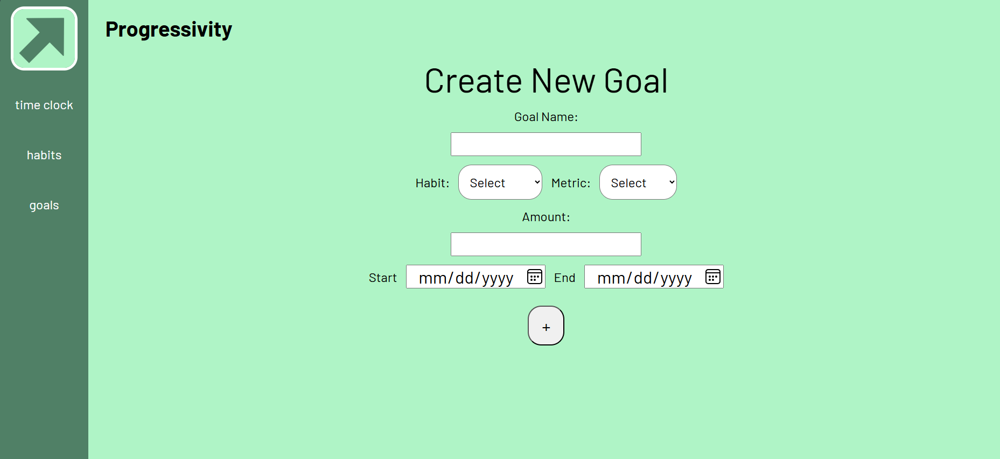

# Progressivity
React-based Web App to keep track of habits and goals.

# Quick Overview
Here are some screenshots taking you through the basic flow of the app. Additional details about the thinking that went behind making this app can be found in the Development and Implementation notes included in this repository.

## Time Clock
Measures the units of each habit
|||
| - | - |
| Count Based Habit| Time Based Habit|
|| |

## Habits
View the list of all habits and details about the records for each one
|||
| - | - |
| Habit Gallery View | Habit Details View|
|| |
|Create New Habit| |
| | |

## Goals
View the list of all goals and details about the completion for each one
|||
| - | - |
| Goal Gallery View | Goal Details View|
|| |
|Create New Goal| |
| | |

# Notes About Current Version
- Time Based Habits are measured in seconds
  - WIP: time measurements will be converted to largest possible unit of measurement (seconds -> minutes -> hours -> days)
- The time clock for time based goals is not completely intuitive because seeing the current amount of time passed requires clicking "update"
  - WIP: time passed will be constantly updated in real time every second

